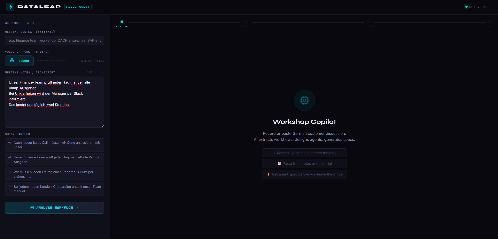
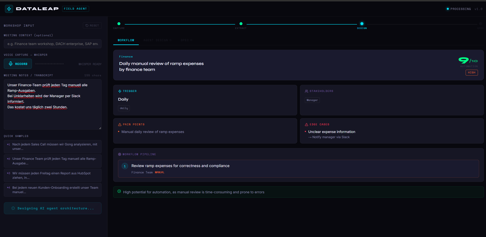
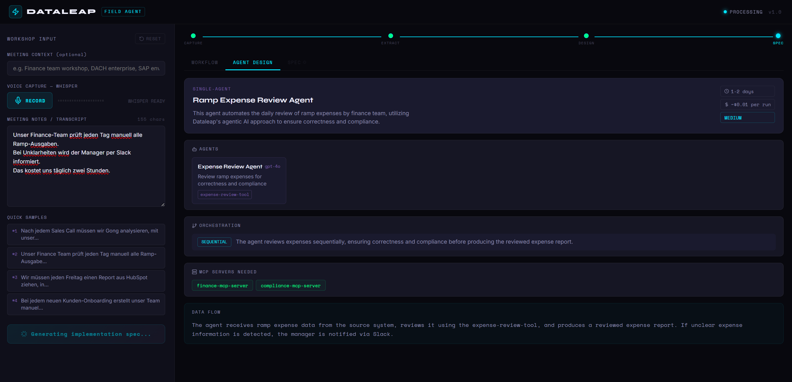
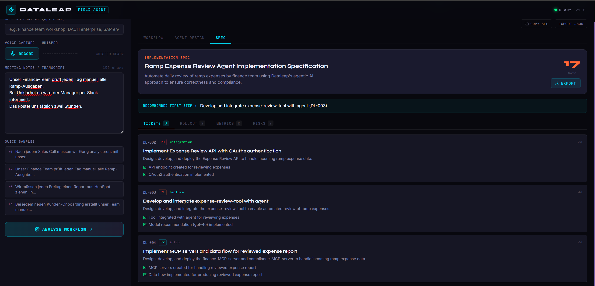

# 🤖 Dataleap Field Agent — Workshop-to-Agent Builder

> **In-person AI copilot for Forward Deployed Engineers.**  
> Converts live German customer discussions into structured AI workflow specifications and deployable agent plans.

---

## What It Does

During on-site DACH customer workshops, this tool helps you:

1. **Record** live German meeting audio (Whisper transcription)
2. **Extract** structured workflows: triggers, actions, tools, stakeholders, edge cases
3. **Design** AI agent architecture using Ollama (local LLM, free)
4. **Generate** full implementation specs: tickets, rollout phases, success metrics
5. **Export** as JSON to share with the team

---

## Screenshots

### Step 1 — Paste or Record German Meeting Notes


The app opens in a clean ready state. On the left, paste German meeting notes or click **RECORD** to capture live audio via Whisper. Quick sample prompts are pre-loaded for testing. The right panel shows the three-step promise: record live → paste from notes → get agent spec before you leave the office. Status shows **READY v1.0** — backend and Ollama are connected.

---

### Step 2 — Workflow Extracted in Real-Time


After clicking **ANALYSE WORKFLOW**, the pipeline fires. The progress bar at the top moves through CAPTURE → EXTRACT → DESIGN → SPEC. The Workflow tab shows the extracted result: team (Finance), trigger (Daily), pain points, edge cases with escalation paths, and the full workflow pipeline. Automation score shows **9/10 HIGH** — the prompt fix correctly rates automation *potential*, not current state.

---

### Step 3 — Agent Architecture Designed Automatically


The Agent Design tab renders while the Spec is still generating (PROCESSING shown top-right). The LLM has decided on a **single-agent** architecture — Ramp Expense Review Agent running gpt-4o. MCP servers needed (`finance-mcp-server`, `compliance-mcp-server`) are called out explicitly. The data flow section describes exactly how the agent handles the happy path and the Slack escalation edge case.

---

### Step 4 — Full Implementation Spec with Tickets


The Spec tab delivers a complete build plan: 3 prioritised tickets (DL-002 P0 → DL-004 P2), rollout phases, success metrics, and risks. Each ticket has acceptance criteria. The recommended first step is called out at the top. Total estimate: **17 days**. The whole output is exportable as JSON via the EXPORT button top-right.

---

## Architecture

```
┌─────────────────────────────────────────────────────────┐
│                   Frontend (React)                       │
│   Voice Input → Text → Workflow → Agent → Spec          │
│   Port: 3000                                            │
└────────────────────┬────────────────────────────────────┘
                     │ HTTP / WebSocket
┌────────────────────▼────────────────────────────────────┐
│                  Backend (FastAPI)                       │
│   /transcribe → /analyze-text → /design-agent           │
│   /generate-spec → /ws/live                             │
│   Port: 8000                                            │
└────────────────────┬────────────────────────────────────┘
                     │
        ┌────────────┴────────────┐
        │                         │
┌───────▼──────┐        ┌────────▼────────┐
│    Ollama    │        │  Whisper API    │
│  llama3.1   │        │ (OpenAI or CLI) │
│  Port: 11434 │        │ German audio    │
└──────────────┘        └─────────────────┘
```

---

## Quick Start

### Prerequisites

- Python 3.11+
- Node.js 18+
- [Ollama](https://ollama.ai) (free, local LLM)
- ffmpeg (for local Whisper)

---

### 1. Install Ollama + Pull Model

```bash
ollama pull llama3.1

# Start Ollama if not auto-started:
ollama serve
```

---

### 2. Backend Setup

```bash
cd backend

# Create virtual environment
python -m venv venv

# Activate — choose your OS:
source venv/bin/activate        # macOS / Linux
venv\Scripts\activate           # Windows (PowerShell)

# Install dependencies
pip install -r requirements.txt

# Configure environment
cp .env.example .env
# Edit .env — set OPENAI_API_KEY for Whisper API transcription
# Otherwise local Whisper CLI is used (pip install openai-whisper)

# Start backend
uvicorn main:app --reload --port 8000
```

Backend → http://localhost:8000  
API docs → http://localhost:8000/docs

---

### 3. Frontend Setup

```bash
cd frontend
npm install
npm start
```

Frontend → http://localhost:3000

---

### 4. Optional: Local Whisper (offline transcription)

```bash
pip install openai-whisper

# macOS
brew install ffmpeg

# Windows (PowerShell) — apt does NOT work on Windows
winget install ffmpeg

# Ubuntu / Debian
apt install ffmpeg
```

> After installing ffmpeg, close and reopen your terminal so the PATH updates, then verify: `ffmpeg -version`

---

## Whisper Configuration

| Option | Setup | Cost |
|--------|-------|------|
| **OpenAI Whisper API** | Set `OPENAI_API_KEY` in `.env` | ~$0.006/min |
| **Local Whisper CLI** | `pip install openai-whisper` + ffmpeg | Free, slower |
| **Stub mode** | No setup needed | Free, returns sample text |

---

## LLM Configuration

| Option | Setup | Cost |
|--------|-------|------|
| **Ollama llama3.1** | `ollama pull llama3.1` | Free, local |
| **Ollama mistral** | `ollama pull mistral` | Free, faster |
| **OpenAI GPT-4o-mini** | Set `OPENAI_API_KEY` | ~$0.01/run |

---

## API Endpoints

| Endpoint | Method | Description |
|----------|--------|-------------|
| `/transcribe` | POST | Audio file → German transcript |
| `/analyze-text` | POST | Text → Structured workflow |
| `/extract-workflow` | POST | Transcript → Workflow |
| `/design-agent` | POST | Workflow → Agent architecture |
| `/generate-spec` | POST | Workflow + Agent → Full spec |
| `/ws/live` | WebSocket | Real-time streaming pipeline |

---

## Usage in the Field

1. Open http://localhost:3000 on your laptop
2. Join customer workshop
3. Click **RECORD** — streams to Whisper live
4. Click **STOP** when done
5. Click **ANALYSE WORKFLOW**
6. Get structured spec in ~30 seconds
7. **Export JSON** or share screen with the customer

---

## Prompt Engineering — What Was Improved

The core extraction prompt in `backend/services/workflow_extractor.py` went through several iterations during testing with real DACH customer workshop transcripts. Here's what was fixed and why:

### Fix 1 — Action Decomposition
**Problem:** Multiple distinct checks were being collapsed into a single step, e.g. *"Review expense for correctness and compliance"* instead of separate steps for amount, invoice, and guidelines.

**Fix:** Added an explicit decomposition rule with a BAD vs GOOD example. Any action containing "and", "or", "und", "sowie", "bzw." is always forced into two separate steps — no exceptions.

### Fix 2 — German Domain Vocabulary
**Problem:** "Ausgabe" was being translated as "output" (correct literal translation) instead of "expense" (correct in a Finance/Ramp context).

**Fix:** Added a ~50-term vocabulary table covering 5 categories — Finance, Approvals, Workflow, People, and Systems — with explicit disambiguation rules for ambiguous terms like Ausgabe, Protokoll, Abnahme, and Meldung.

### Fix 3 — Automation Score Direction
**Problem:** `automation_score` was rating the current automation level of the workflow, not its automation potential. A fully manual workflow that is trivially automatable was scoring 2/10.

**Fix:** Rewrded the rule to explicitly say *"rate AUTOMATION POTENTIAL, not current automation level"* with examples of what scores high vs low.

### Fix 4 — Full Translation Coverage
**Problem:** Nested fields like `stakeholders`, `edge_cases.scenario`, and `edge_cases.handling` were being left in German even when the top-level fields were translated.

**Fix:** Replaced the generic "translate German content" instruction with an explicit field-by-field list: summary, pain_points, actions, stakeholders, edge_cases.scenario, edge_cases.handling, automation_rationale, and notes.

---

## Project Structure

```
dataleap-field-agent/
├── backend/
│   ├── main.py                    # FastAPI app + all routes
│   ├── requirements.txt
│   ├── .env.example
│   ├── models/
│   │   └── schemas.py             # Pydantic data models
│   └── services/
│       ├── transcription.py       # Whisper (API + local)
│       ├── workflow_extractor.py  # Ollama workflow extraction ← main prompt file
│       ├── agent_designer.py      # Ollama agent design
│       └── spec_generator.py      # Ollama spec generation
├── frontend/
│   ├── package.json
│   ├── public/index.html
│   └── src/
│       ├── App.js
│       ├── index.js
│       ├── index.css              # Design system + CSS vars
│       ├── utils/api.js           # API client
│       ├── hooks/
│       │   └── useVoiceRecorder.js
│       ├── components/
│       │   ├── Header.js
│       │   ├── VoiceInput.js
│       │   ├── WorkflowResult.js
│       │   ├── AgentDesign.js
│       │   └── SpecDisplay.js
│       └── pages/
│           ├── WorkshopPage.js
│           └── SpecPage.js
└── README.md
```

---

## Tech Stack

| Layer | Technology | Why |
|-------|-----------|-----|
| Frontend | React 18 + React Router | Fast, mobile-friendly |
| Styling | CSS-in-JS (inline) | Zero dependencies, portable |
| Voice | MediaRecorder API + Whisper | Browser-native recording |
| Backend | FastAPI + Uvicorn | Fast async Python |
| LLM | Ollama (llama3.1) | Free, local, no API key needed |
| Transcription | OpenAI Whisper | Best German accuracy |
| Data models | Pydantic v2 | Type-safe structured output |

---

## The Pitch

> "Since the role requires heavy on-site customer work across DACH,  
> I didn't want German to be a limitation.  
> I wanted to solve it like an engineer.
>
> So I built a small POC:  
> an in-person workshop copilot that converts live German customer discussions  
> into structured AI workflow specifications and deployable agent plans.
>
> The goal is not translation — it is faster workflow discovery and faster shipping."

---

## Future Improvements

### Prompt Quality
- Add conditional branch detection — the extractor currently misses "if X then Y" logic in workflows, which means approval gates (e.g. deal > €50k → management sign-off) appear in edge cases but not as proper action steps
- Expand vocabulary table to cover more industry verticals beyond Finance — HR, Logistics, and Legal have their own ambiguous German terms
- Add a confidence score per extracted field so the UI can flag low-confidence extractions for human review

### Product Features
- **Multi-language support** — the prompt and vocabulary layer is German-only; extending to French and Dutch would cover more of the DACH + Benelux territory
- **Session persistence** — currently resets on page refresh; adding local storage or a lightweight backend store would let FDEs resume mid-workshop
- **Template library** — let FDEs save and reuse agent designs for common patterns (expense review, sales follow-up, weekly reporting) instead of generating from scratch each time
- **Direct Jira/Linear export** — the spec generates tickets as JSON; one step further would be pushing them directly to the customer's project board via API
- **Voice speaker diarisation** — currently treats all audio as one speaker; distinguishing customer vs FDE voice would improve extraction accuracy in live recording mode
